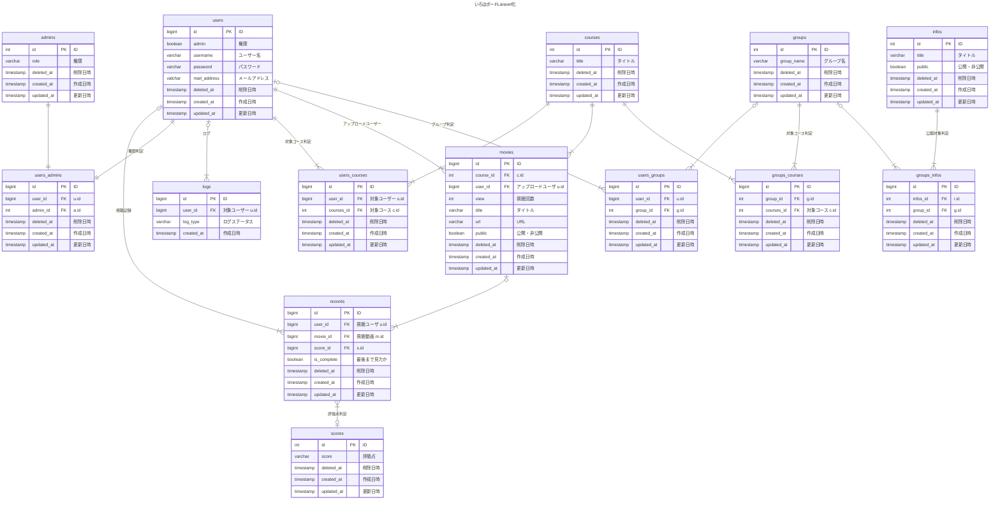

```mermaid
---
title: "いろはボードLaravel化"
---
erDiagram
    users o|--|{ records: "視聴記録"
    users ||--|| users_admins: "権限判定"
    users o|--|{ logs: "ログ"
    users ||--|{ users_courses: "対象コース判定"
    users ||--|{ movies: "アップロードユーザー"
    users o|--|{ users_groups: "グループ判定"

    courses ||--|{ users_courses: ""
    courses ||--|{ movies: ""
    courses ||--|{ groups_courses: ""

    groups o|--|{ users_groups: ""
    groups ||--|{ groups_courses: "対象コース判定"
    groups o|--|{ groups_infos: ""

    admins ||--|| users_admins: ""
    infos ||--|{ groups_infos: "公開対象判定"
    movies o|--|{ records: ""
    records }|--|o scores: "評価点判定"

    admins {
        int id PK "ID"
        varchar role "権限"
        timestamp deleted_at "削除日時"
        timestamp created_at "作成日時"
        timestamp updated_at "更新日時"
    }

    courses {
        int id PK "ID"
        varchar title "タイトル"
        timestamp deleted_at "削除日時"
        timestamp created_at "作成日時"
        timestamp updated_at "更新日時"  
    }

    groups {
        int id PK "ID"
        varchar group_name "グループ名"
        timestamp deleted_at "削除日時"
        timestamp created_at "作成日時"
        timestamp updated_at "更新日時"
    }

    infos {
        int id PK "ID"
        varchar title "タイトル"
        boolean public "公開・非公開"
        timestamp deleted_at "削除日時"
        timestamp created_at "作成日時"
        timestamp updated_at "更新日時"  
    }

    logs {
        bigint id PK "ID"
        bigint user_id FK "対象ユーザー u.id"
        varchar log_type "ログステータス"
        timestamp created_at "作成日時"
    }

    movies {
        bigint id PK "ID"
        int course_id FK "c.id"
        bigint user_id FK "アップロードユーザ u.id"
        int view "視聴回数"
        varchar title "タイトル"
        varchar url "URL"
        boolean public "公開・非公開"
        timestamp deleted_at "削除日時"
        timestamp created_at "作成日時"
        timestamp updated_at "更新日時"  
    }

    records {
        bigint id PK "ID"
        bigint user_id FK "視聴ユーザ u.id"
        bigint movie_id FK "視聴動画 m.id"
        bigint score_id FK "s.id"
        boolean is_complete "最後まで見たか"
        timestamp deleted_at "削除日時"
        timestamp created_at "作成日時"
        timestamp updated_at "更新日時"  
    }

    scores {
        int id PK "ID"
        varchar score "評価点"
        timestamp deleted_at "削除日時"
        timestamp created_at "作成日時"
        timestamp updated_at "更新日時"  
    }

    users {
        bigint id PK "ID"
        boolean admin "権限"
        varchar username "ユーザー名"
        varchar password "パスワード"
        valchar mail_address "メールアドレス"
        timestamp deleted_at "削除日時"
        timestamp created_at "作成日時"
        timestamp updated_at "更新日時"
    }

    users_admins {
        bigint id PK "ID"
        bigint user_id FK "u.id"
        int admin_id FK "a.id"
        timestamp deleted_at "削除日時"
        timestamp created_at "作成日時"
        timestamp updated_at "更新日時"
    }

    users_courses {
        bigint id PK "ID"
        bigint user_id FK "対象ユーザー u.id"
        int courses_id FK "対象コース c.id"
        timestamp deleted_at "削除日時"
        timestamp created_at "作成日時"
        timestamp updated_at "更新日時"
    }

    users_groups {
        bigint id PK "ID"
        bigint user_id FK "u.id"
        int group_id FK "g.id"
        timestamp deleted_at "削除日時"
        timestamp created_at "作成日時"
        timestamp updated_at "更新日時"
    }

    groups_infos {
        bigint id PK "ID"
        int infos_id FK "i.id"
        int group_id FK "g.id"
        timestamp deleted_at "削除日時"
        timestamp created_at "作成日時"
        timestamp updated_at "更新日時"
    }

    groups_courses {
        bigint id PK "ID"
        int group_id FK "g.id"
        int courses_id FK "対象コース c.id"
        timestamp deleted_at "削除日時"
        timestamp created_at "作成日時"
        timestamp updated_at "更新日時"
    }
```